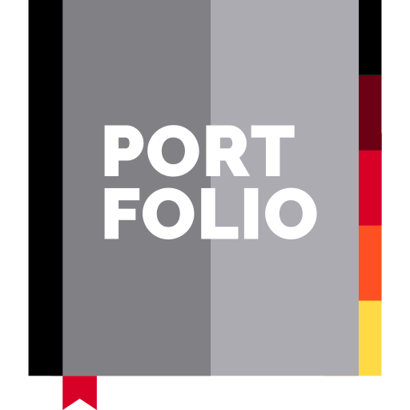

#  Portfolio

### **👁️ Overview**
Personal Website - 2024.

  Portfolio is a personal website created to showcase my professional journey and highlight key aspects of my career.
  It offers a comprehensive overview of my work experience, educational background, technical skills, and personal projects.
  Through this platform, I aim to provide visitors with insight into my growth as a software engineer and my passion for technology,
  demonstrating both my technical expertise and creative problem-solving abilities.  

#

### **⚙️ Tech Stack**
- .NET 8 - ASP.NET Core Blazor Server
- Bootstrap 5

#

### **🛠️ Tools**
- Source Control: GitHub
- IDE: Rider